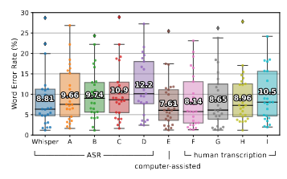
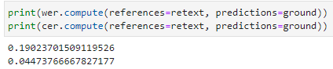
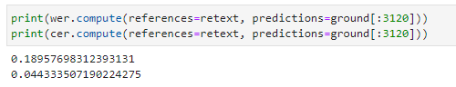
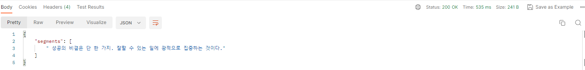

# Whisper

### Amount of dataset

양과 질을 고려하여 680,000시간 데이터셋을 사용

<!-- truncate -->

### Preprocessing

특별한 preprocessing을 진행하지 않음.

### Audio language detector

오디오는 VoxLingua107 데이터셋으로 fine-turning해서 구분

transcript는 CLD2를 사용하여 언어를 감지하여 사용

## Model

기성품 세팅사용 - transformer를 사용, 16000 Hz, 80채널 mel-spectogram, -1 ~ 1 사이로 z-score 정규화

### Added function

voice activity detection, speaker diarization, inverse text normalization 들을 사용하여 성능을 높임

### Metric

기본적으로 WER를 사용하나, Non-semantic difference를 최소화하기 위하여 standardization을 사용

### Test Dataset

TED-LIUM3, Meanwhile(The Late Show), Kincaid46, Rev16, Earnings-21, Earnings-22, CORAAL

## Experiments

### Long-form Transcription

Whisper 모델의 학습데이터는 기본적으로 30초씩 잘라서 학습한다. 그러나 추론 방법에 따라 긴 시퀀스가 입력으로 들어올 경우에 30초씩 잘라서, 윈도우을 이동해가면서 추론을 진행한다.


### Human Performance 비교

WER metrics만을 이용해서는 impovements를 확인하는 것이 어렵기 때문에 Kincaid46 데이터셋을 사용하여 사람이 작성한 human transcription과 직접적으로 WER을 비교 - 결과는 사람이 한것과 유사함



### Text normalization


fairspeech’s normalizer 보다 좋다

## Appendix

### C. Text standardization

Since Whisper may output any UTF-8 string rather than a restricted set of graphemes, the rules for text standardization need to be more intricate and comprehensive than those defined on e.g. ASCII characters. We perform the following steps to normalize English texts in different styles into a standardized form, which is a best-effort attempt to penalize only when a word error is caused by actually mistranscribing a word, and not by formatting or punctuation differences.

1. Remove any phrases between matching brackets ( [, ] ).
2. Remove any phrases between matching parentheses ( (,) ).
3. Remove any of the following words: hmm, mm, mhm, mmm, uh, um
4. Remove whitespace characters that comes before an apostrophe ’
5. Convert standard or informal contracted forms of English into the original form.
6. Remove commas (, ) between digits
7. Remove periods (. ) not followed by numbers
8. Remove symbols as well as diacritics from the text, where symbols are the characters with the Unicode category starting with M, S, or P, except period, percent, and currency symbols that may be detected in the next step.
9. Detect any numeric expressions of numbers and currencies and replace with a form using Arabic numbers, e.g. “Ten thousand dollars” → “$10000”.

10. Convert British spellings into American spellings.

11. Remove remaining symbols that are not part of any numeric expressions.

12. Replace any successive whitespace characters with a space. 

A different, language-specific set of transformations would be needed to equivalently normalize non-English text, but due to our lack of linguistic knowledge to build such normalizers for all languages, we resort to the following basic standardization for non-English text:

1. Remove any phrases between matching brackets ( [, ] ).
2. Remove any phrases between matching parentheses ( (, )).
3. Replace any markers, symbols, and punctuation characters with a space, i.e. when the Unicode category of each character in the NFKC-normalized string starts with M, S, or P.
4. make the text lowercase.
5. replace any successive whitespace characters with a space.

Additionally, we put a space between every letter for the languages that do not use spaces to separate words, namely Chinese, Japanese, Thai, Lao, and Burmese, effectively measuring the character error rate instead.

We note that the above is an imperfect solution, and it will sometimes produce unintended and unexpected outputs. We do not claim that the text format resulting from the above is more “correct” in any measure. Rather, the procedures above are designed to better distinguish between innocuous differences in wording and genuine mistranscriptions. Python code for the standardization procedures above is available as part of our code and model release to facilitate future iterations and improvements on text standardization 


### E. Hyperparameter


## AI Hub 데이터를 이용하여 학습한 wec, cer

- 비대면 진료를 위한 의료진 및 환자 음성
    
    [AI-Hub](https://aihub.or.kr/aihubdata/data/view.do?currMenu=115&topMenu=100&aihubDataSe=realm&dataSetSn=208)
    
- Result
    
    
    
    
    

## Planing

1. fine-tuning
2. 모델의 사이즈 감소 - inference의 효율성 개선


1. Transformers의 구조를 RETRO transformer로 변형 할 수 있으면 진행 
2. quantization으로 개선
3. Ctranslate2 사용하여 모델 inference개선
    - 사용 결과
        - 기본 whisper 모델 불러와서 transcription 했을 경우 - 2.51초
        
        
        
        - Ctranslate2 적용된 faster-whisper 사용했을 경우 - 약 1초 (967 ms)
        
        
        
        - ONNX convert 적용된 경우  - transformers의 Optimum 사용
            - Base모델이 0.557초 이므로 ~~large모델의 경우 절반 감소하여 1.25초 예상~~  Large model 버그 존재하여 몇초 이상 걸림…(10초까지도..)
            - (TODO : large는 OPTIMUM에 적용 안됨 - 재구현 필)
            - transformer OPTIMUM에 있는  ONNX모델은 transcribe 대신 translate로 구현되어 있는듯 보임[https://github.com/huggingface/transformers/pull/19525#issuecomment-1421100270](https://github.com/huggingface/transformers/pull/19525#issuecomment-1421100270)
                
                
                
            - Optimum안의 ORTModelForSpeechSeq2Seq나 다른 speech 모델이 업데이트 되거나 fastt5처럼 직접 onnx converter를 구현 시켜줘야 할듯으로 보임
        
        - JAX convert 적용된 경우 - [https://github.com/sanchit-gandhi/whisper-jax#creating-an-endpoint](https://github.com/sanchit-gandhi/whisper-jax#creating-an-endpoint)
            - 10초 이상 걸림…? 왜이러지?
                
                
                
            - base
            
            
            
            - github issue 에 느리다는 글이 여러개 인걸로 보아, 확실히 이슈 있는듯.
            
        - kernl
            - docker내부에서 실험
            docker pull nvidia/cuda:11.3.1-cudnn8-devel-ubuntu20.04 --> nvidia/cuda:kernl
            - docker image 업데이트
            `docker commit <<docker_id>> <dockername::tag>`
            - ~~실험 결과 현재 데이터를 장치에 할당하는 "cuda:1" 이 부분에 에러가 발생하여 현재 학습중인 gpu 끝나고 다시 테스트 예정(~~즉 gpu를 선택할 수 없음~~)~~
            - GPU 사용중 일 때 속도 비율
        
        
        
        - 참조  1. - Bloom에서 사용한 방법 : [https://huggingface.co/blog/bloom-inference-optimization](https://huggingface.co/blog/bloom-inference-optimization)
            - **First inference (PP + Accelerate)**
        
        - 결론 : Ctranslate2로 wrap된 Faster-Whisper api 테스트
            - C레벨로 감싼 모델의 gpu할당은 대략 3기가
            - 현재  onnx와 jax는 재구현 필요
            - 일단 tensorrt를 변환하기 위해서  onnx 먼저 구현
        
    - 단점
        - 다른 메모리 감소들과 결합 불가로 보임
            - onnx가 C 기반으로 변환되므로 Ctranslate2와 병행되어 사용불가 하므로 onnx의 함수인 quantization도 사용 불가
            - 다른 optimization… 밑으로

## Optimizing

To speedup for inference 

using kernel from ELS-RD/kernel repository

[https://github.com/ELS-RD/kernl](https://github.com/ELS-RD/kernl)


[https://www.notion.so](https://www.notion.so)

# Whisper API

3가지 경우를 고려하여 call을 보내봄

1. 시간대별로 응답시간이 다른가? 즉 짧은 발화면 생성속도가 빠를 것인가?
2. 비슷한 내용에 뒷부분을 추가한다면 내부에 cache를 써서 중복된 내용은 어느정도 속도가 보장될 것인가?
3. 여러번 호출해도 응답이 잘 처리 되는가?

### 실험 내용

- 4가지의 데이터를 이용하여 실험, 이 4가지의 데이터는 한 문장의 발화를 각 다른 길이로 자른 것


- 가장 짧은 첫번째 데이터(1초짜리 발화)라도 응답속도가 1초가 넘음(
- 평균적으로 1.3초, 같은 데이터나 발화의 일부분이 중복되더라도 시간은 줄지 않음
- 같은 데이터를 같은 시간대에 보내면 응답속도가 비슷함(병렬), 사용량 많아지면 느려질듯..


### Fastapi를 이용한 서버사용

- a100에서 whisperAPI 가동 실험
    
    
    
- GPU 사용량
    
    
    

### Locust를 이용한 Testing

- tests_performancs.py ( $ locust -f tests_performance.py --host [http://127.0.0.1:8000](http://127.0.0.1:8000/) )


### OCR model

[https://github.com/kakaobrain/pororo](https://github.com/kakaobrain/pororo)

[https://github.com/clovaai/CLEval](https://github.com/clovaai/CLEval)

[https://github.com/clovaai/deep-text-recognition-benchmark](https://github.com/clovaai/deep-text-recognition-benchmark)

동향 from kakao

- [https://yongwookha.github.io/MachineLearning/2022-02-08-current-ocrs](https://yongwookha.github.io/MachineLearning/2022-02-08-current-ocrs)

[Whisper-training](https://www.notion.so/Whisper-training-5b2e6f19812e47669ebafd987fdb9110?pvs=21)

[WhisperX](https://www.notion.so/WhisperX-85d83fe8565c4aceb70c0ef68b91361e?pvs=21)

[whisper demostration](https://www.notion.so/whisper-demostration-6a38238e94334dfbae633692f8bda6a5?pvs=21)

[bug](https://www.notion.so/bug-ca804e35e6494a959b2b03cbec617043?pvs=21)


```python

```
