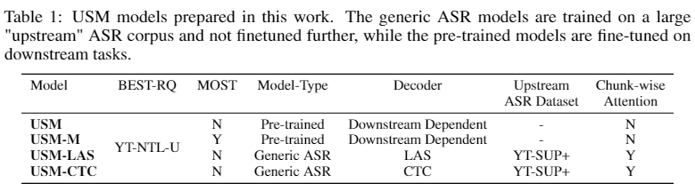

# Google USM

# Google USM

## Abstract and Introduction

<!-- truncate -->

굉장히 whisper를 의식하면서 작성된 논문

vector quantized는 **Self-Supervised Learning of Discrete Speech Representations** 등에서 등장해옴 (codebook)

100+ 언어로 ASR를 할수 있으며, 인코더는 레이블 되지 않은 1200만시간으로 300언어를 통해 학습하였고, fine-tuning을 더 작은 레이블된 데이터를 통해 학습하였다.

위스퍼에 비해 1/7이지만 in-domain과 out-of domain 음성인식이 더 잘된다고 주장한다.

대화 지도 학습 접근법에 따라 길고 비싼 음성데이터는 수기로 기록되어야 한다(transcribed). 그러나 transcribed 된 데이터는 많이 모으기 힘드니 untranscribed된 스피치데이터와 텍스트데이터는 제한이 없다. 최근에 semi-supervised 알고리즘을 통해 제한된 양의 transcribed 데이터로 높은 퀼리티를 제공한다. 이 논문 또한 그러하다.

### Out approach

Unpaired Audio

- YT-NTL-U : 12000만시간의 유튜브 기반한 레이블 되지 않은 300언어 이상의 데이터셋
- Pub-U : 429k 시간의 레이블 안된 51언어 공개데이터

Unpaired Text

- Web-NTL : 1140언어로 28B 문장 구성된 텍스트 코퍼스

Paired ASR Data

- YT-SUP : 90k 시간의 레이블된 데이터, 73개 언어와 100k 시간의 영어 pseudo-labeld data
- Pub-S : 10k 시간 레이블된 멀티도메인 영어 데이터와 102개 언어로 구성된 10k 레이블 공개데이터

모델은 2B개의 파라미터인 Conformer

1. Unsupervised Pre-training - BEST-RQ(BERT-based Speech pre-Training with Random projection Quantizer)로 YT-NTL-U 데이터를 이용해서 인코더를 pre-train
2. MOST(Multi-Objective Supervised pre-Training) 3 종류의 데이터 YT-NTL-U, Web-NTL, Pub-S, Pub-U를 이용해서 학습하는데, BEST-RQ MLM Loss와 text-injection losses를 합
3. Supervised ASR Training 드디어 ASR CTC를 이용해서 generic ASR모델을 만들고, Listen, Attend and Spell(LAS) transducers를 downstream tasks에 사용



그림을 보면 Generic ASR에는 모두 Chunk-wise Attention을 사용. USM과 USM-M은 MOST 적용 및 적절한 CTC나 LAS, RNN transducer unit등을 사용하여 downstream task에 적용할 수 있다. 여기서 ASR은 유튜브 데이터를 사용하여 학습했고, SpeechStew, FLEURS, CORAAL등을 사용하여 평가했고, AST(Automatic Speech Translation)은 CoVoST2를 사용하여 평가했다.  이 Table 1을 보면 generic과 pre-trained ASR models을 freeze 시켜놓고 adaptor만 학습하여 확장한다.


학습은 3 stages로 나뉘는데 먼저 conformer backbone을 large unlabeled speech dataset으로 학습면서 BEST-RQ 목적을 최적화한다. 2번째로 multiple objectives들을 최적화하는 동안 speech representation learning model 학습한다. 세번째로 ASR과 AST task에 맞추어서 fine-tunes

**Key Findins**

SpeechStew, CORAAL, FLEURS, YT, CoVoST 모두 SOTA를 찍었다~ 유튜브에서 73언어에 WER이 30%이하를 달성했다. 90k hours시간만으로도 Whisper보다 낫다.


**BEST-RQ**는 2B Conformer-based backbone으로 아주 큰 데이터에 효과적으로 pre-training 할수 있었고, Wav2Vec 2.0과 W2v-BERT과 비견된다.

**MOST (BERT-RQ + text-injection)** scalable speech and text representation learner 102개 언어 ASR과 21개 언어의 AST에 효과직어리고 한다.

**Representations from MOST** 는 **새로운 도메인**에 빠르게 적용가능하기 때문에 frozen model에 전체중에 2%의 parameters만 추가해도 좋은 powerful downstream ASR/AST models 이라고 주장한다.

**Chunk-wise sttention for robust long-form speech recognition** chunk-wise attention은 효과적이고 짧은 발화부터 매우 긴 음성 입력까지 확장 할 수 있다.  USM-CTC/LAS 모델은 유튜브 평가셋에서 매우 긴 발화에서도 매우 높은 퀼리티의 전사 스크립트를 생산가능한다. 

### Outline

**방법** : Conformer, BERT-RQ, MOST에 사용하는 text-injection, Noisy Student Training(NST), 그리고 긴 발화에도 학습으로 확장가능한 chunk-wise attention

**데이터** : YT-NTL-U, Web-NTL

**Key Result** : ASR, AST 소타

**Analysis and Ablations :** 기존의 방법론들과 비교해서 좋다.

### Related Work

pre-training, self-training 방법론, 기존에 monolingual과 multilingual contexts 둘다 학습하는 방법론, 큰 multi-modal speech model

- 300언어의 USM, ASR, AST 둘다 적용 가능하며 작은 지도학습으로 새로운 언어도 적용
- 73언어의 ASR, 90k 시간 지도학습, TPU에서 효과적으로 수행하며, 시간당위의 유튜브 오디오 자막도 생성
- pre-training, noisy student training, text injection, 모델 사이즈의 다언어 ASR

## 2. Methods

### 2.1 Conformer

CTC, RNN transducer, LAS 유닛들을 붙일 수 있는 encoder 모델. BEST-RQ 는 효과적으로 encoder에 적용할 수 있고, 더 나아가 T5로 확장하여 학습할 수 있을 것이다.


### 2.2 BEST-RQ

음성 오디오로 pre-train 방법으로 BEST-RQ를 선택했다. 간단하고 적은  하이퍼파라미터로 비지도학습 가능하다.


BERT-RQ 는 BERT-style 학습으로 masked speech features들을 예측하는 모델이다. 많은 quantization targets c와 무작위 codebook vectors가 embedding으로 골라진다. **w2v-BERT**는 더 큰 복잡도를 가진 추가적인 quantization module을 붙였다. 그러나 **BERT-RQ** pre-training에 더 확장성을 가진 방법이다. 

### 2.2.1 Multi-softmax

BEST-RQ 학습을 향상시키기 위해 single 대신 multiple codebooks 을 사용한다. masked speech features로부터 더 정확하게 N Nsoftmax layers 로 N probability predictions 생성한다. 

### 2.3 Self-training : Noisy Student Training

단어와 오디오 길이 비율에 따른 휴리스틱 필터링 적용(레이블 없는 데이터에 pseudo label 추가)

### 2.4 Chunk-wise Attention for Long-form ASR

ASR에 30초 이하 오디오 학습하는데 글로벌 어텐션을 오디오 전체에 집중시키는 것은 비현실적이다. 그래서 왼쪽 혹은 오른쪽의 정해진 길이에 영향끼치는 local self attention이 쓰인다. 예를들어 BEST-RQ pre-training은 오직 128 왼쪽과 128 오른쪽 frames이 local self attention에 사용된다. 그러나 stacking 하다보면 학습과 추론이 상당히 다르게 만들어 질수도 있다.


그림에서는 4개의 local self attention layers이고, 각각 오직 1번 왼쪽, 1번 오른쪽 context frames을 사용한다. 그래서 context가 각 레이어에 부족할 때, receptive filed 너비는 레이어 수에 따라 선형적으로 커진다. Conformer-2B는 encoder output의 receptive field가 327초이상 커질 수 있기 때문에 본 논문에서는 이를 “long-form (performance) degradation” 문제라고 한다.

이거를 해결하기 위해 audio chunks 에 따라 어텐션에 제약을 건다. 오른쪽 그림처럼 2개의 chunks로 나누고 이 청크 안에서만 수행한다. 이 때 각 어텐션 레이어에 no context leaking 될 수 있고,  receptive filed width는 각 레이어의 수에 독립적이다. 실험에서는 8-second 길이로 chunk를 자른게 가장 효과적이라고 한다.

컨셉은 block procssing과 유사하지만 chunk-wise는 더 유연하다. block processing은 현재 chunk에 제한된 인코더 레이어로 input feature level에서 수행하지만, 반면에 chunk-wise attention은 다른 레이어로 현재 chunk 그 너머에서 수행한다. 30초 chunks와 휴리스틱한 절차로 디코더를(transformer hyperparameter 말하는 듯) 수행하는 위스퍼와 비교해서 본 논문은 attention state만 chunk해서 decoder에 전체 encoder output을 수행하도록 한다. 또한 long-form audio를 생성하기 위해 CTC나 RNN-T decoder 쓰는데 둘 다  attention-based s2s decoders와 비교해서 hallucinate가 관찰되지 않았다고 한다. 


MOST text injection.  unlabeled text and paired speech and text data. 

### Multi-Objective Supervised Pre-training: BEST-RQ + text-injection

BEST-RQ는 2가지 이점이 있다.

첫번째로 speech와 text data를 이용해서 paired로 학습하면서 ASR과 AST같은 Task의 퀼리티를 향상시킨다.

두번째로 unlabeled text의 학습은 low resource languages and domain에서 robustness를 향상시킨다.

speech-only encoder는 convolutional sub-sampling feature와 single conformer layer를 활용한다. text-only encoder는 eembedding layer, upsampler, conformer layer block로 구성

text-injection의 메인 아이디어는 to produce joint, co-aligned embeddings of speech and text as sequences in the same embedding space. 이 embedding space 에서 오디오 없는 텍스트 데이터가 speech task를 향상시켜준다고 한다?

이를 위해 3가지 타입의 데이터와 다른 losses가 있다.

1. 레이블 없는 speech가 encoder를 거쳐 BEST-RQ softmax
2. standard ASR, text 데이터가 text encoder를 거쳐 speech sequence에 대하여 학습(pfrozen speech encoder)
3. 레이블 없는 text로 reconstruction loss 학습. 이 때 masking을 하는데 이 masking은  masked speech featrues와 동일한 embedding space

MOST는 paired data로 staable decoder 를 20k steps 학습하고, 레이블 없는 text의 duration upsampler activate 학습, detail은 **Maestro: Matched speech text representations through modality matching** 을 읽어봐야함

ASR fine-tuning은 speech feature encoder학습하고 shared conformer encoder와 transducer(CTC 등등) 학습

### Training Details

**Data Processing:** The audio is uniformly sampled to 16 kHz quality—any audio with a different native sampling rate. **128-dimensional** log-mel filterbank coefficients. **Graphemes** are used to tokenize the text for FLEURS in-domain fine-tuning, while **word-piece models** (WPMs) [68] are used for tokenization for all othertasks.

**BEST-RQ**: 논문 “**Self-supervised learning with random-projection quantizer for speech recognit” 16 codebook multi-softmax loss** 

**MOST**:  4k sentence-piece models (SPMs). We use a single **1536-dimensional Conformer layer** as the speech encoder and Conformer-2B encoder as the shared encoder. 배치사이즈는 **4096, 8192, and 1024.** BEST-RQ pre-trained encoder사용, **un-transcribed speech and paired speech-text data, and unspoken text**을 20k steps. **three types of data**을 ****100K steps.

## 3. Datasets


### **Audio**

YouTube SUPervised Plus (YT-SUP+)

**YT-SUP+**: YT-SUP is a dataset with audio from video

YouTube Next Thousand Languages Unsupervised (YT-NTL-U)

**YT-55-U**: YT-55-U is built by first randomly collecting 3 million hours of audio from "speech-heavy”

**YT-513-U**: We create an additional dataset called YT-513-U to ensure coverage of lower resource languages in our pre-training dataset

### Text Data

**Web-NTL**: For pre-training with unlabeled text, we use a web-crawled corpus of monolingual text containing over 28B sentences.

**Downstream Benchmarks**

 SpeechStew [2] and FLEURS [16], and an internal benchmark on YouTube.


WERs. exception of CoVoST 2, for which the BLEU score is presented

## 4. Key Results

### Robust Speech Recognition for Massively Multilingual Tasks

USM-CTC는 훨신 적은 데이터로 잘나온다.

USM-LAS는 long-form degradation 문제가 있기 때문에 좀더 필요

### Massively Multilingual Results Beyond 100 Languages

### MOST Produces Robust Representations that Generalize to New Domains

### Pushing the Quality of ASR on Unseen Languages


### USMs are Strong AST Models

## 5. Analysis and Ablations

### 5.1 Multi-softmax Loss for BEST-RQ

multi-soft로 5% 이상 향상(CoVoST 인듯)


### Model and Language Scaling

### BEST-RQ is a Scalable Self-supervised Learner


### Chunk-wise attention for robust long-form speech recognition


### TPU Serving Capacity of USM-CTC Models


```python

```
