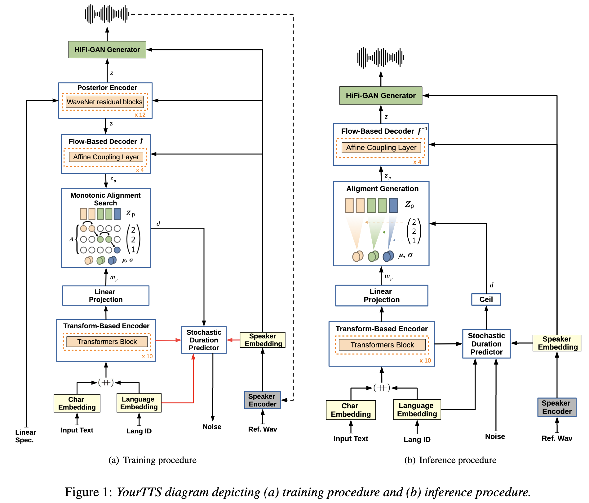

# YOURTTS

### Abstract

YOURTTS는 multilingual approach to the task of zero-shot multi-speaker TTS. 이 모델은 VITS[Conditional Variational Autoencoder with Adversarial Learning for End-to-End Text-to-Speech] 기반으로 zero-shot multi-speaker와 multilingual 학습을 위해서 몇몇 수정을 거친 모델이다. 그래서 zero-shot multi-speaker TTS에 sota를 달성했다. 그리도 VCTK 데이터셋에서 zero-shot voice convention 에서도 SOTA를 달성했다. 그리고 single-speaker dataset에서도 promising results이다. 또한 1분 미만의 데이터에서도 voice similarity와 합리적인 퀄리티를 보였다. 

<!-- truncate -->

### Introduction

synthesizing voices for new speakers에 관심이 있어서 zero-shot multi-speaker TTS(ZS-TTS)를 학습한다. 처음에는 DeepVoice 3 방법을 확장했다. 반면에 Tacotron2 는 외부 speakers embeddings을 generalized end-to-end loss(GE2E)를 써서 encoder를 학습시켰다. 이거는 LDE embeddings으로 unseen speakers의 similarity와 naturalness를 향상시켰다. 대조적으로 Attentron은 다양한 래퍼런스 source들과 coarse-grained encode를 통해 detailed styles를 추출하려고 한다. 그 결과 unseen speaker에게서 voice similarity를 높게 뽑았다. ZSM-SS는 트랜스포머 기반으로 normalization과 wev2vec으로 encoder를 추가했다. SC-GlowTTS는 ZS-TTS에서 flow-based models의 첫 응용이다. 퀄리티 유지하면서 voice similarity를 잘 향상시켰다.

본 논문의 YOURTTS는 정리하자면

- 영어에서 SOTA
- a multilingual  in the zero-shot multi-speaker TTS
- 학습할 때 단지 타켓 언어의 1명 스피커로도 zero-shot multi-speaker TTS과 zero-shot Voice Conversion with promising quality and similarity
- 1분 미만 데이터로도 퀼리티와 충분한 유사도를 얻는다.

### YourTTS Model

VITS 기반으로 zero-shot multi-speaker와 multilingual training을 위한 수정을 덧붙였다. 또한 본 논문의 모델은 phonemes 대신 text를 사용했다. 

multilingual training에서 concatenate 4-dimensional trainable language embeddings into the embeddings of each input character. 또한 transformer block이 10개, hidden chanel은 196. 디코더에서는 4 affine coupling layers를 사용했고 각 레이어는 4 [WaveNet residual blocks](https://www.researchgate.net/figure/Residual-block-of-Wavenet-Architecture_fig1_336871762)을 VITS 모델안에 넣었다.

```python
#Density Estimation using Real NVP
#https://github.com/paultsw/nice_pytorch/blob/15cfc543fc3dc81ee70398b8dfc37b67269ede95/nice/layers.py#L109
class _BaseCouplingLayer(nn.Module):
    def __init__(self, dim, partition, nonlinearity):
        """
        Base coupling layer that handles the permutation of the inputs and wraps
        an instance of torch.nn.Module.

        Usage:
        >> layer = AdditiveCouplingLayer(1000, 'even', nn.Sequential(...))
        
        Args:
        * dim: dimension of the inputs.
        * partition: str, 'even' or 'odd'. If 'even', the even-valued columns are sent to
        pass through the activation module.
        * nonlinearity: an instance of torch.nn.Module.
        """
        super(_BaseCouplingLayer, self).__init__()
        # store input dimension of incoming values:
        self.dim = dim
        # store partition choice and make shorthands for 1st and second partitions:
        assert (partition in ['even', 'odd']), "[_BaseCouplingLayer] Partition type must be `even` or `odd`!"
        self.partition = partition
        if (partition == 'even'):
            self._first = _get_even
            self._second = _get_odd
        else:
            self._first = _get_odd
            self._second = _get_even
        # store nonlinear function module:
        # (n.b. this can be a complex instance of torch.nn.Module, for ex. a deep ReLU network)
        self.add_module('nonlinearity', nonlinearity)
class AffineCouplingLayer(_BaseCouplingLayer):
"""Layer with coupling law g(a;b) := a .* b1 + b2, where (b1,b2) is a partition of b."""
	def coupling_law(self, a, b):
		return torch.mul(a, self._first(b)) + self._second(b)
```

Vocoder 는 HiFi-GAN version 1로 VITS에서 쓰던 것과 똑같다. 게다가 효과적인 e2e 학습을 위해 VAE를 이용하여 연결했다. VITS는 posterior encoder도 소개를 했는데 본 논문에서도 쓴다. 이 posterior encoder는 16 non-causal WaveNet residual blocks으로 이루어저 있다. 입력으로 posterior encoder는 linear spectogram을 받고, vocoder에서 사용할 a latent variable을 예측한다. 그래서 mel-spectogram 같은 intermediate representation이 전혀 쓰이지 않는다. 위의 방법은 intermediate representation 을 배울 수 있고, vocoder와 TTS model의 따로 학습하는 superior results를 얻는다. 게다가  입력 텍스트로 음성을 합성하여 stochastic duration predictor를 사용한다. 

아래 그림에서 빨간 연결선은 no gradient이고, dashed connections(점선?)은 옵션, Hifi-GAN discriminator는 그림에서 간략화를 위해 빠져있다…

model zero-shot multi-speaker generation를 위해  all affine coupling layers of the flow-based decoder, the posterior encoder, and the vocoder on external speaker embeddings 들을 조정한다. 또한 the text encoder output and the decoder output를 이용해서 the external speaker embeddings 합쳤다. linear projection layers은  element-wise summations하기 전에 차원수를 맞추기 위해서 사용했다.



Speaker Consistency Loss(SCL)을 마지막 Loss에 사용한는데, 이 경우에 사전학습된 speech encoder가  유사도를 최대화할 때 생성된 오디오와 ground truth의 speaker embedding을 추출하기 위해 사용된다. 마지막으로 $\phi$는 스피커의 embedding을 뽑아내고 $cos\_sin$ 는 코사인 유사도, $a$는 상수값 $n$는 배치사이즈로 scl수식은 다음과 같다.   

$$
L_{scl} = \frac{-a}{n}\cdot\sum_{i}^n \text{cos\_sim}(\phi(g_i), \phi(h_i))
$$

$g$와 $h$는 생성된 음성 오디오와 ground truth의 represent이다.

학습동안 Posterior Encoder는 입력으로 linear spectrograms and speaker embeddings을 받고 latent variable $z$를 예측한다. 이 $z$ 는 vocoder의 입력으로 들어가서 waveform 을 생성하다. 효과적인 vocoder 학습을 위해 z에서 임의로 상수길이만큼 추출한다. Flow-based 디코더는 $z$의 형태와 사전확률 $P_{Z_{p}}$에 관련된 speaker embeddings를 목표로 한다. text encoder의 output으로 $P_{Z_{p}}$ 사전확률 분포에 맞추기 위해 **Monotonic Alightment Search(MAS)**를 사용한다. **The stochastic duration predictor**는 입력으로 speaker embeddings, language embeddings  그리고 MAS를 통해서 얻은 duration 을 받는다.  사람 같은 음성 리듬을 생성하기 위해 stochastric duration predictor는 다양한 낮은 phoneme(pseudo-phoneme) duration의 log-likelihood를 낮춘다(**Evidence lower bound)**. 

Inference에서 MAS는 사용 안하고 대신, text encoder로 예측된 $P_{Z_{p}}$ 분포가 사용되고 duration은 정수로 바꾼 stochastic duration predictor를 통해서 duration이 sampled 된다. 이 때 $z_{p}$는  $P_{Z_{p}}$ 분포에서 sampled 된다.  그래서 입력으로 이 $z_{p}$와 speaker embeddings을 inverted Flow-based decoder가 받아서 vocoder에서 waveform을 생성한다.

## Experiments

### 3.1 Speaker Encoder

Speaker Encoder로 H/ASP model을 사용한다. 이 모델은 VoxCeleb2 데이터셋에서 prototypical angular plus softmax loss function를 사용해서 학습되었다.  이 모델은 VoxCeb 1 test에서 SOTA라서 썻다. 추가적으로 Multilingual LibriSpeech(MLS) 을 test subset으로 사용했다. 그래서 Equal Error Rate(EER)을 평균 1.967를달성했다. SC-GlowTTS는 EER이 5.244라고한다.

### 3.2 Audio datasets

3개의 언어를 조사했는데 언어 하나당 1개 데이터셋을 사용했다. 모든 언어에서 pre-processing은 침묵이 긴 주기를 제거하고 비슷한 소리크기를 비슷하게 맞추기 위해 사용했다.  모든 오디오는 16Khz 이고 Webrtevad toolkit을 이용하여 VAD적용했다. 추가적으로 python ffmpeg-normalize안에 있는 RMS-based normalization -27DB 적용했다.

**English:** VCTK dataset, 109speaker의 44시간 speech

**Portuguese:** TTS-Portuguese Corpus

**Frence:** M-AILABS dataset안에 있는 fr_FR , 이 데이터는 LibriVox 기반으로 2 female과 3 male speakers가 71시간 

### 3.3 Experimental setup

Experiment 1: VCTK dataset (monoligual)

Experiment 2: VCTK dataset and TTS-Portuguese datasets(bilingual)

Experiment 3: VCTK dataset and TTS-Portuguese datasetsand AILABS french datasets(tilingual)

Experiment 4: experiment 3 add 1151 additional English speakers from LibriTTS train-clean-100 and train-clean-360

## 4. Results and Discussion

Mean Opnion Score(MOS)로 음성 퀄리티를 평가했다. 유사도를 비교하기 위해서는 Speaker Encoder Cosine Similarity(SECS)를 -1과 1사이로 계산했다. 이전 연구에서 Resemblyzer의 encoder를 사용했길래 우리도 사용했다. 따라서 Similarity MOS(Sim-MOS) 보고한다. 

3언어에도 불구하고 MOS metrics이 너무 high cost라서 오직 2개 언어만 이 메트릭으로 계산한다.영어(가장 많은 스피커), 포르투칼어(가장 적은 스피커). 또한 학습때 없던 스피커도 메트릭으로 비교한다.

MOS는 엄격한 클라우드소싱으로 얻었고, MOS와 Sim-MOS를 영어에서 비교하기 위해 276과 200 네이티브 영어 contributors로, 포르투칼은 90

VCTK 50문장 사용

MOS, SECS, Sim-MOS을 LbriTTS에서 위해 20단어 이상 55문장을 임의로 뽑았다.


### 4.4 Speaker Consistency Loss

Speaker Consistency Loss(SCL)은 SECS로 측정된 유사도를 향상시킨다. 반면에 Sim-MOS는 결론이 모호하다. 그럼에 불구하고 우리는 SCL이 training에 안보인 특성에 관하여 일반화하는데 도움준다고 믿는다.  실험 1에서 SCL 덕분에 SECS와 SIM-MOS가 향상됬다. 반면에 이것은 SCL이 약간 생성한 오디오의 퀼리티를 감소시킨다. 

## 5. Zero-Shot Voice Conversion

GC-GlowTTs모델에서 했던것처럼 본 논문 역시 스피커 id를 encoder에 넣지 않았다. 그래서 encoder의 분포는 speaker에 독립적이다. 그래서 YourTTS는 모델의 Posterior Encoder와 HiFi-Gan을 이용하여 변환할 수 있다. external speaker embeddings으로 안본 스피커도 모방할 수 있다.

MOS와 Sim-MOS를 AutoVC(Zero-Shot Voice Style Transfer with Only Autoencoder Loss) 와 NoiseVC모델에서 결과를 봤다.

### 5.1. Intra-lingual results

학습하지 않은 10 VCTK speakers로 영어와 포르투갈 transferring도 확인했다.


low quality 때문에 포르투갈 남성에서 영어 여자 MOS score는 떨어졌다(pt-en). 일반적으로는 위에서 보이듯이 여자 스피커 데이터의 부족으로 여자 스피커로 변환되는 성능이 떨어졌다. 

영어에서 변환하는 동안 스피커의 성별은 모델의 성능에 많은 영향을 끼치지 않았다. 그러나 포르투갈은 여자 음성의 부족으로 일반화를 방해했다.

## 6. Speaker Adaptation

다른 녹음 조건은 zero-shot multi-speaker TTS에서 도전이다. 그러나 우리의 모델에서 잠재력을 봤다(IM/IF). Weighted random sampling는 1/4 배치에서 나타난 스피커를 샘플하는 것을 보장한다. 


## 7. Conclusions. limitations and future work

zero-shot multi-speaker TTS와 VCTK 데이터셋에서 zero-shot voice conversion에서 소타다. 또한 싱글 스피커 데이터셋으로 타겟 언어에 유망한 결과를 달성한다. 추가적으로 우리는 음성과 기록상태 둘다 가진 스피커를 학습 안해도 1분 미만의 음성으로 조정가능하다.

그러나 몇몇 스피커와 문장으로 부자연스러운 기간때문에 stochastic duration predictor가 견고하지 못하다. 또한 포르투갈어는 몇몇 단어에서 잘못된 발음한다. 음성학 스크립트를 쓰지 않아서 그런 것일 수도 있다. 특정 성별 비율때문에 모델에 영향이 있다. Speaker Adaption에서는 20초 음성으로 특성을 뽑아냈지만 45초면 더 좋을 것이다. 

미래엔 우리는 duration predictor성능을 높일거고, 음성인식으로 데이터 증강할것이다.


```python

```
