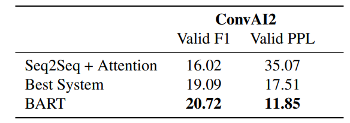
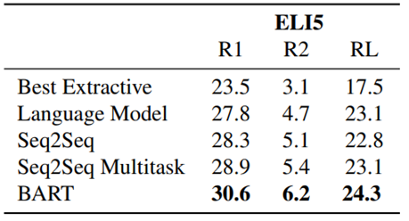

# BART: Denoising Sequence-to-Sequence Pre-training for Natural Language Generation, Translation, and Comprehension


<!-- truncate -->

We present BART, a denoising autoencoder for pretraining sequence-to-sequence models.  
BART is trained by (1) corrupting text with an arbitrary noising function,   
and (2) learning a model to reconstruct the original text.

## introduction
Variants of masked language models, which are denoising autoencoders that are trained to reconstruct text where a random subset of the words has been masked out.

- For example improving the distribution of masked tokens(SpanBERT-a geometric distribution)
- The order in which masked tokens are predicted (XLNet)
- the available context for replacing masked tokens (UniLM - unidirectional LM, Bidirect LM, sequence LM을 앙상블)

Finding the best performance by both randomly shuffling the order of the original sentences and using a novel in-filling scheme(including zero length)

BART uses a standard Tranformer-based neural machine translation architecture which, despite its simplicity, can be seen as generalizing BERT (due to the bidirectional encoder), GPT (with the left-to-right decoder), and many other more recent pretraining schemes.

랜덤한 단어가 mask되어 있는 문장을 다시 복원하는 Masked language model과 denoising auto-encoder가 좋은 성능을 보인다. 그 중에서는 분포에 기반하여 span을 정하거나 auto-regressive 하거나 앙상블하는 방법들이 있다. 
Bart는 masked 방법 중 랜덤하게 순서를 석고, SpanBERT 처럼 radom text infiiling하는 것이 가장 성능이 좋았다.


모델은 generalizing BERT (due to the bidirectional encoder), GPT (with the left-to-right decoder)사용

논문뒤에 related work가 나오는데 앞으로 가져왔습니다.
- GPT는 leftward context만 다루기 때문에 몇몇 task에서는 문제가 생긴다.
- ELMo는 left-only와 right-only representation을 concatenate하는데 두 표현 사이의 상관관계는 학습하지 않는다.
- GPT2는 아주 큰 language model이 unsupervised, multitask 모델처럼 동작하는 것을 보였다.
- BERT는 좌우 context word의 상관관계를 학습하는 masked language modelling을 소개했다. 학습을 오래하거나(RoBERTa), 레이어의 파라미터를 공유하는 방법(ALBERT), 단어를 masking 하는 대신 공간을 masking 하는 방법(SpanBERT)이 더 향상된 성능을 보였다. BERT는 예측이 auto-regressive 하지 않아서 생성 task에는 약하다.
- UniLM은 unidirectional LM, Bidirect LM, sequence LM을 앙상블한 모델이다. 각 LM task 사이의 파라미터와 모델 구조를 통일함으로써, 여러 LM을 만들어야 했던 필요성을 완화합니다. BART처럼 생성과 분류 task 모두 가능하다. BART와 차이점은 UniLM의 prediction은 conditionally independent하다는 점이다. BART는 항상 완전한 입력이 디코더에 주어져서 pre-training과 생성의 차이가 적다.
- MASS는 BART와 가장 유사한 모델이다. 연속된 span이 masking된 문장을 인코더 입력으로 주고, 디코더에서 masking 되었던 토큰들을 예측한다.
- XL-Net은 mask된 토큰을 섞인 순서로 auto-regressive하게 예측하도록 BERT를 확장했다.


## model

### Architecture
BART의 encoder는 Bert와 동일하게 ReLU activation function을 GeLUs로 변경했다. base model은 6 layer, large model은 12 layer를 사용했다. 다른점은 BERT는 word prediction을 위해 추가로 feed-forward 레이어를 추가했는데 BART는 그렇지 않다.
디코더는 트랜스포머에서처럼 디코더의 각 레이어에서는 트랜스포머 처럼 인코더의 마지막 hidden layer와 cross-attention을 한다. 

### Pretraining BART
specific noising schemes
구체적인 노이즈 방법은 다음과 같다.


- Token Masking: BERT처럼 랜덤 토큰을 [MASK]로 masking  
- Token Deletion: 랜덤 토큰을 삭제. 삭제된 문장을 찾는다.
- Text Infilling: 포아송 분포를 따르는 길이의 text span을 생성해서 [mask] 하나로 교체. SpanBERT는 분포에 따라 동일한 span을 mask했는데 Bart는 0개부터 여러개가 바뀜
- Sentence Permutaion: Document를 문장 순서 바꿈
- Document Rotation: 토큰 하나를 정해서 문장이 그 토큰부터 시작하게 한다. 모델이 document의 시작을 찾아야 한다.


## Fine-tuning BART

### Sequence Classification Tasks


디코더의 마지막 hidden state vector를 사용하여 linear classifier. 이 때 디코더에 완전한 문장을 표시하기 위하여 end 토큰 추가했다.

### Token Classification Tasks
전체 document를 인코더와 디코더에 입력한다. 디코더의 top hidden state를 각 단어에 대한 representation으로 사용한다. 이 representation을 token classification에 사용한다.

### Sequence Generation Tasks
BART는 autoregressive 디코더로 abstractive question answering이나 summairization에 바로 fine-tuning이 가능하다. 

### Machine Translation
by adding a new set of encoder parameters that are learned from bitext   
인코더를 하나 더 추가해서 인코더-디코더를 fine-tuning 한다.  
새로운 인코더를 먼저 학습하고 그다음 BART모델을 학습한다.(embedding 2개) 이 때 인코더와 BART의 position embedding, BART 인코더의 첫번째 레이어 self-attention input projection matrix만 학습시킨다. 
두번째 단계에서는 모든 파라미터를 학습시킨다.

## Comparing Pre-training Objectives

BART는 더 넓은 범위의 noising schemes를 사용한다.  
combination of books and Wikipedia data 를 사용해 1M steps 으로 Base모델 끼리 비교를 해보자면 (6 encoder and 6 decoder layers, with a hidden size of 768)
### Comparison Objectives
- Language Model: GPT와 비슷하다. left-to-right 트랜스포머 모델을 학습시킨다. 이 모델은 cross-attention이 빠진 BART 디코더와 같다.
- Permuted Language Model: XL-Net을 기반으로 한다. 1/6 토큰을 샘플링하고 이것을 랜덤한 순서로 auto-regressive하게 생성한다.
- Masked Language Model: BERT처럼 15% 토큰을 mask 토큰으로 바꾸고 독립적으로 이 토큰을 예측하게 한다.
- Multitask Masked Language Model: UniLM처럼 self-attention mask를 추가해서 masked language model을 학습한다. self-attention mask는 1/6은 left-to-right, 1/6은 rignt-to-left, 1/3은 unmasked로 적용되고, 나머지 1/3은 처음 50% 토큰에는 mask가 없고 나머지 토큰에는 left-to-right mask를 적용한다.
- Masked Seq-to-Seq: MASS와 비슷하다. 토큰의 50%를 포함하는 span에 mask를 하고 mask된 토큰을 예측하는 seq-to-seq 모델을 학습시킨다. 일반적인 seq-to-seq task처럼 source를 인코더에 주고 target을 디코더 output으로 하는 방법과 source를 디코더 target의 prefix로 주고 target 부분만 loss를 계산하는 방법으로 학습시켰다. 전자의 방법이 BART 모델에 더 잘했고 후자는 나머지 모델에 더 잘했다.

### Tasks
- SQuAD: Extractive QA task. 주어진 document에서 정답을 추출한다. BERT와 유사하게 질문과 document를 concatenate해서 BART 인코더, 디코더 입력으로 준다. Classifier를 포함하는 모델이 정답의 시작과 끝 토큰 인덱스를 예측한다.
- MNLI: Bitext classification task다. 두 문장의 의미적 관계를 분류하는 task. 두 문장을 concatenate하고, eos 토큰을 추가해서 BART 인코더 디코더에 입력한다. eos 토큰의 representation이 문장의 관계를 예측하는데 사용된다.
- ELI5: Abstractive QA task. 질문과 document를 사용해 정답을 생성한다.
- Xsum: Abstractive summary task.
- ConvAI2: Persona를 사용하는 대화 생성 task.
- CNN/DM: 뉴스 요약 task.


## Results


- Performance of pre-training methods varies significantly across tasks
- Token masking is crucial
- Left-to-right pre-training improves generation
auto-regressive가 generation에는 중요하다
- Bidirectional encoders are crucial for SQuAD
Bart는 layer개수를 절반만 가지고 달성
- The pre-training objective is not the only important factor
such as relative-position embeddings or segment-level recurrence 학습방법만이 성능의 주요요인은 아니다.


## Large-scale Pre-training Experiments

최근 연구에서 큰 batch size와 corpora를 사용해 pre-training하는 것이 성능의 향상을 이끌어낸다고 한다. 이를 실험하기 위해 BART를 RoBERTa 모델과 같은 규모로 실험했다.

- Large 모델은 12레이어, 1024 hidden size
- RoBERTa처럼 batch size는 8000, 모델을 50만번 학습
- GPT2와 같은 byte-pair encoding을 사용해 토크나이징
- Text infilling과 sentence shuffling을 섞어서 pre-training. 이 때, document의 30% 토큰을 masking 했고, 모든 문장의 순서를 바꿈
- 마지막 10%의 training step에서는 dropout을 적용하지 않음.
- RoBERTa와 같은 160Gb 데이터 사용


- Generation에서 빔사이즈는 5, 이 때, 중복된 trigram은 삭제
- 번역쓰이는 첫번째 encoder는 6-layer transformer source encoder to map Romanian into a representation
- Xsum에서 첫번째 문장 삭제






```python

```
